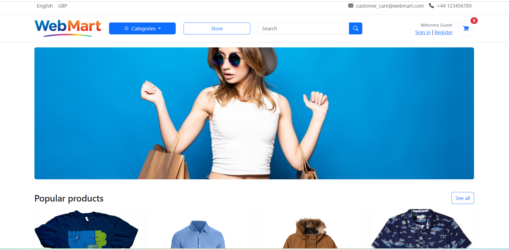
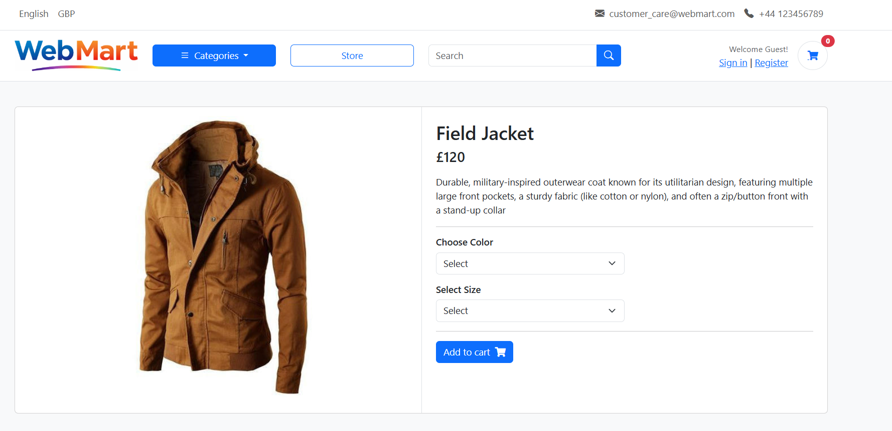
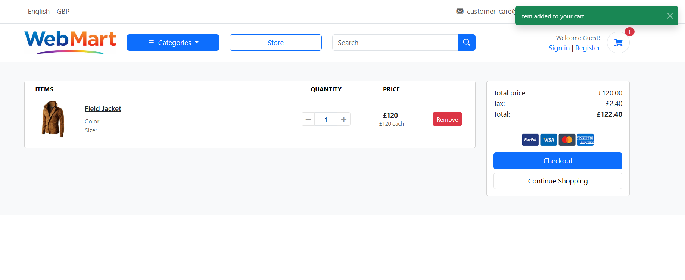
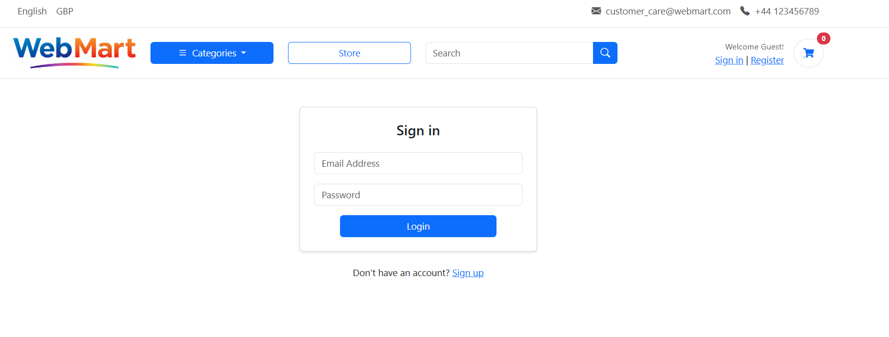
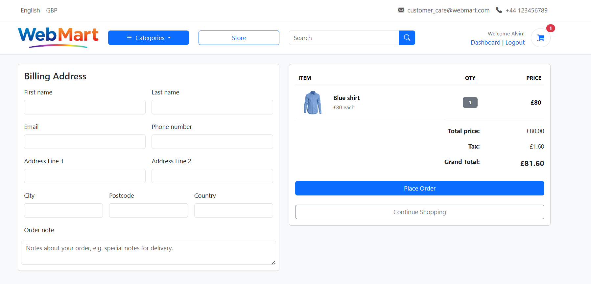
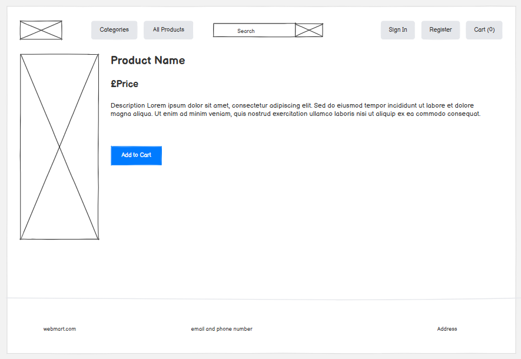
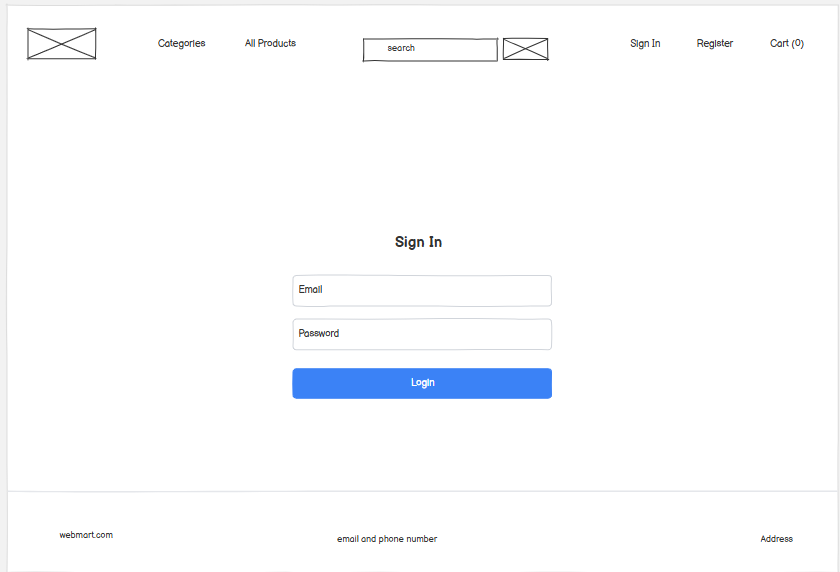
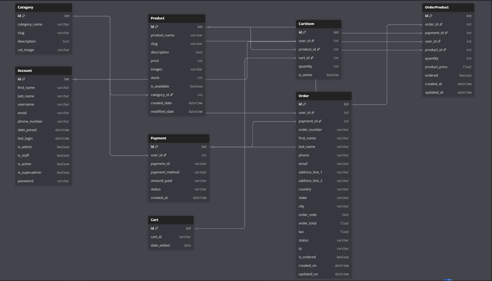
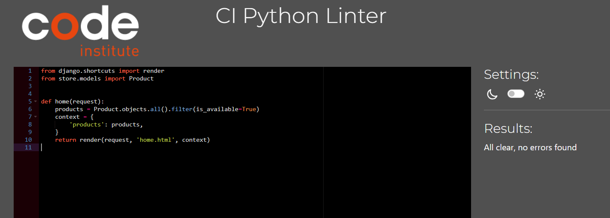
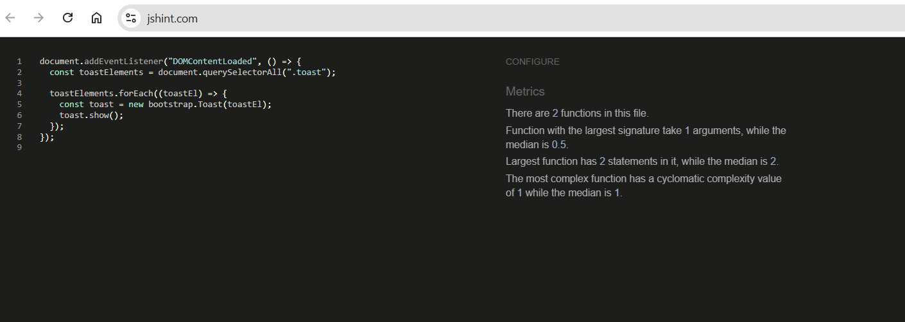

# WebMart - E-Commerce Store Application

WebMart is a full-featured e-commerce web application built with Django and PostgreSQL which allows users to browse products,login, manage shopping carts, place orders, and manage their user accounts.

Source code can be found [here](https://github.com/sheenaanto/WebMart)

The live project can be viewed [here](https://webmart-df0a62d3a5c7.herokuapp.com/)

Table of Contents

- [Purpose of the project](#purpose-of-the-project)
- [Features](#features)
- [User Experience](#user-experience)
- [Development Process](#development-process)
- [Data Model](#data-model)
- [Testing](#testing)
- [Libraries and Programs Used](#libraries-and-programs-used)
- [AI Usage in Development](#ai-usage-in-development)

## Purpose of the project

This project was developed as a learning exercise to demonstrate full-stack web development skills using Python with Django and PostgreSQL. It showcases practical implementation of e-commerce functionality including user authentication, product management, shopping cart operations, and order processing with a modern, responsive user interface.

## Features

- **User Authentication**: User registration, login, and dashboard
- **Product Catalog**: Browse products by categories with detailed product information
- **Shopping Cart**: Add/remove items from cart with persistent storage
- **Order Management**: Place orders and view order history
- **Responsive Design**: Mobile-friendly interface using Bootstrap 5
- **Admin Panel**: Django admin interface for managing products, categories, and orders
- **Toast Notifications**: User feedback with success, error, warning, and info messages

### All Users

The following pages are visible to all users, logged in or not.

Homepage (landing page)

#### Key Features

The landing page offers users different options:

- Navigate through categories
- Navigate through products
- View cart items
- Store
- Search for products
- Sign in
- Register

Store page

#### Key Features

Different options available are :

- Product details view option
- View cart
- Search for products
- Sign in
- Register

Products details page

#### Key Features

Different options available are :

- Navigate through categories
- Product details view option
- View cart
- Search for products
- Sign in
- Register

Carts page

#### Key Features

Different options available are :

- +/- for increase/decrease options
- Remove cart item
- checkout (Login/Register page)
- Continue shopping

login page

#### Key Features

Different options available are :

- Login button
- Sign up

Register page

#### Key Features

Different options available are :

- Enter details
- Register
- Login

### Authenticated (Logged in) Users

The following pages are only available to logged in users.

Dashboard

#### Key Features

This page shows details on:

- Total no.of orders placed
- Order history
- User details
- Logout

Checkout

#### Key Features

This page offers users different options:

- Enter billing address
- Place order
- Continue shopping
- Logout

## User Experience

This section details the key elements of the user experience (UX) design for the project, including visual design choices, color schemes, typography, and wireframes. It provides insight into the aesthetic and functional decisions made to enhance usability across different devices, ensuring a seamless and accessible experience for users.

### Design

#### Fonts/Icons

- Inter font
  This font was used throughout the project for headings and prominent text.This is a great choice for an e-commerce platform as it balances professionalism with modern aesthetics.It is a modern, clean sans-serif font that provides excellent readability for web interfaces.

- Font Awesome - Icon library
  The navbar heavily uses Bootstrap Icons for the header elements.

- Bootstrap Icons - Icon library
  Throughout the product pages and cart functionality for action-related icons.

#### Colour

The following colour palette was used in the project:

**Primary Colors**

| Color  | Hex Code  | RGB               | Usage                                      |
| ------ | --------- | ----------------- | ------------------------------------------ |
| Blue   | `#3167eb` | rgb(49, 103, 235) | Primary brand color, buttons, hover states |
| Orange | `#ff9017` | rgb(255, 144, 23) | Accent color, alerts, warnings             |
| Green  | `#00b517` | rgb(0, 181, 23)   | Success states, confirmations              |
| Red    | `#fa3434` | rgb(250, 52, 52)  | Error states, alerts                       |

## Wireframes

These wireframes illustrate how each page is designed to adapt across various screen sizes, including Mobile, Tablet, Desktop, and Larger Screens. While the overall layout remains consistent, adjustments have been made to optimize the user experience for each viewport. Key differences include variations in button placement, layout, and card arrangements to ensure usability and visual clarity across devices.

Desktop

Homepage

Product detail page

Cart Page

Login page

Dashboard

Checkout page

Tablet

Mobile

## Development Process

The development process for this project was carefully planned and documented to ensure efficient progress and transparency.

### Project Planning and Documentation Using GitHub

#### Userstories

All user stories can be found here.Issues were posted to the board and moved from "Todo" to "In Progress" to "Done" as they were completed. MoSCoW prioritisation was applied using the labels must-have, should-have, and could-have.
[Project Board](https://github.com/users/sheenaanto/projects/17)

  

Must have

- [View paginated list of products](https://github.com/sheenaanto/WebMart/issues/1)
- [Filter products by category](https://github.com/sheenaanto/WebMart/issues/2)
- [View Product Details](https://github.com/sheenaanto/WebMart/issues/3)
- [Search Products](https://github.com/sheenaanto/WebMart/issues/4)
- [Add product to cart](https://github.com/sheenaanto/WebMart/issues/7)
- [View shopping cart](https://github.com/sheenaanto/WebMart/issues/8)
- [Increase/decrease cart items](https://github.com/sheenaanto/WebMart/issues/9)
- [Remove Item from Cart](https://github.com/sheenaanto/WebMart/issues/10)
- [User Registration](https://github.com/sheenaanto/WebMart/issues/11)
- [User login](https://github.com/sheenaanto/WebMart/issues/12)
- [Dashboard](https://github.com/sheenaanto/WebMart/issues/6)
- [User cart](https://github.com/sheenaanto/WebMart/issues/14)
- [Checkout Page](https://github.com/sheenaanto/WebMart/issues/5)
- [User Logout](https://github.com/sheenaanto/WebMart/issues/13)
- [Messages for action](https://github.com/sheenaanto/WebMart/issues/17)

Should have

[Cart Persistence for Logged-in Users](https://github.com/sheenaanto/WebMart/issues/16)  
[Browse Categories through sidebar](https://github.com/sheenaanto/WebMart/issues/15)

Could have

[Cart item auto‑added on login](https://github.com/sheenaanto/WebMart/issues/18)

Won't have

[Payment](https://github.com/sheenaanto/WebMart/issues/19)
[Returns and reorder](https://github.com/sheenaanto/WebMart/issues/20https://github.com/sheenaanto/WebMart/issues/20)
[Product Reviews](https://github.com/sheenaanto/WebMart/issues/21)

## Data Model

This section provides an overview of the data models used in the project, represented through Entity-Relationship Diagrams (ERDs) for each application.

## Tables Description

### Account

Custom user model for authentication and user management.

- **Primary Key**: id
- **Unique Fields**: username, email
- **Purpose**: Stores user account information
- **Special**: Uses Django's AbstractBaseUser for custom authentication

### Category

Product categorization system.

- **Primary Key**: id
- **Unique Fields**: category_name, slug
- **Purpose**: Organizes products into categories
- **Features**: Includes images via Cloudinary

### Product

Product catalog with inventory management.

- **Primary Key**: id
- **Unique Fields**: product_name, slug
- **Foreign Keys**: category_id → Category
- **Purpose**: Stores product information and inventory
- **Features**: Price, stock tracking, availability status

### Cart

Shopping cart sessions for anonymous and authenticated users.

- **Primary Key**: id
- **Purpose**: Maintains shopping session
- **Features**: Can be associated with cart_id (session) or user_id

### CartItem

Individual items within shopping carts.

- **Primary Key**: id
- **Foreign Keys**:
  - user_id → Account (nullable)
  - product_id → Product
  - cart_id → Cart (nullable)
- **Purpose**: Tracks products added to cart with quantities
- **Features**: Supports both guest and logged-in user carts

### Payment

Payment transaction records.

- **Primary Key**: id
- **Foreign Keys**: user_id → Account
- **Purpose**: Stores payment information and status
- **Features**: Tracks payment method, amount, and status

### Order

Customer order details.

- **Primary Key**: id
- **Foreign Keys**:
  - user_id → Account (SET_NULL on delete)
  - payment_id → Payment (nullable)
- **Purpose**: Stores order information and shipping details
- **Status Options**: New, Accepted, Completed, Cancelled
- **Features**: Complete shipping address, order tracking

### OrderProduct

Junction table linking orders with products.

- **Primary Key**: id
- **Foreign Keys**:
  - order_id → Order
  - payment_id → Payment (nullable)
  - user_id → Account
  - product_id → Product
- **Purpose**: Tracks individual products within orders
- **Features**: Stores quantity and price at time of purchase

## Relationships

| Relationship           | Type        | Description                         | On Delete |
| ---------------------- | ----------- | ----------------------------------- | --------- |
| Account → Order        | One-to-Many | User places multiple orders         | SET_NULL  |
| Account → Payment      | One-to-Many | User makes multiple payments        | CASCADE   |
| Account → CartItem     | One-to-Many | User has multiple cart items        | CASCADE   |
| Account → OrderProduct | One-to-Many | User purchases multiple products    | CASCADE   |
| Category → Product     | One-to-Many | Category contains multiple products | CASCADE   |
| Product → CartItem     | One-to-Many | Product in multiple carts           | CASCADE   |
| Product → OrderProduct | One-to-Many | Product in multiple orders          | CASCADE   |
| Cart → CartItem        | One-to-Many | Cart contains multiple items        | CASCADE   |
| Payment → Order        | One-to-Many | Payment for multiple orders         | SET_NULL  |
| Payment → OrderProduct | One-to-Many | Payment covers multiple products    | SET_NULL  |
| Order → OrderProduct   | One-to-Many | Order contains multiple products    | CASCADE   |

## Key Constraints

### Unique Constraints

- **Account**: username, email
- **Category**: category_name, slug
- **Product**: product_name, slug

### Nullable Foreign Keys

- **CartItem**: user_id, cart_id (supports guest carts)
- **Order**: payment_id (order can exist before payment)
- **OrderProduct**: payment_id (order product can exist before payment)

## Data Integrity Notes

1. **User Deletion**: Orders are preserved with SET_NULL to maintain historical records
2. **Product Deletion**: Cascades to cart items and order products
3. **Cart System**: Supports both anonymous (cart_id) and authenticated (user_id) shopping
4. **Order Status**: Controlled by predefined choices for consistency
5. **Timestamps**: Automatic tracking on most models for audit trail
6. **Images**: Stored externally via Cloudinary CDN for scalability

## Indexes

Automatically created indexes on:

- Primary keys (all tables)
- Foreign keys (all relationship fields)
- Unique fields (usernames, emails, slugs)
- Django's `auto_now` and `auto_now_add` timestamp fields

## Diagram

## Data Validation

Django Widget attributes have been used to provide min and max markers for form fields ensuring only values in a certain range can be submitted.

## Testing

The Testing section covers various strategies used to ensure the application's functionality and quality

### Manual Testing

Feature Testing

### Responsiveness

All pages on the live site were tested with the default list of devices in Chrome Devtools.

### Lighthouse

The [Lighthouse](https://chromewebstore.google.com/detail/lighthouse/blipmdconlkpinefehnmjammfjpmpbjk) testing was carried out using a chrome extension .The results are displayed by page below:

Lighthouse results

## Validation Testing

### Python Validation

All python code is validated by the [Flake8 linter](https://flake8.pycqa.org/en/latest/) (installed in VSCode) and [CI Python Linter](https://pep8ci.herokuapp.com/). The exceptions to this were django migration files, urls and similar files. However, any custom models, views and forms were validated.

webmart

views.py

store

views.py

accounts

views.py

carts

views.py

orders

views.py

### JavaScript Validation

All JavaScript code is validated by the [ESLint](https://eslint.org/) (installed in VSCode) and [jshint](https://jshint.com/).

Main templete - base.html

Contains global JavaScript that runs on all pages - Bootstrap functionality and toast notifications

Checkout page - checkout.html

Contains page-specific JavaScript for order success modal display

### HTML Validation

All HTML was validating using the page source of the deployed project using [W3C Markup Validation Service](https://validator.w3.org/nu/?level=warning&doc=https%3A%2F%2Fwebmart-df0a62d3a5c7.herokuapp.com%2F). All pages were clear of all errors/warnings.

Results

### CSS Validation

The single CSS file was validated using the [W3C Validation Service](https://jigsaw.w3.org/css-validator/)

Results

## Libraries and Programs Used

This section highlights the key libraries, tools, and platforms utilised throughout the development of the project. These technologies played an essential role in various aspects of the project, from wireframing and version control to deployment and testing.

- **Balsamiq**: Wireframing tool used to design all project pages
- **dbdiagram.io**: Online tool for converting text into visual database diagrams
- **Git**: Version control system implemented via GitHub terminal
- **GitHub**: Cloud repository for code storage, deployment via GitHub Pages, and project tracking (User Stories, Epics, bugs)
- **VS Code**: Primary IDE with ESLint and Flake8 linters configured for JavaScript and Python validation
- **Heroku**: Deployment platform for the live application

## AI Usage in Development

AI tools, particularly GitHub Copilot, were used throughout the development of this project to improve productivity, support learning, and enhance overall code quality. Below is a summary of how AI contributed across different areas.

### Learning & Best Practices

AI also acted as a learning companion by:

- Explaining CSS properties and Bootstrap utilities
- Highlighting accessibility considerations
- Providing multiple approaches to solve implementation challenges
- Helping reinforce clean, maintainable coding patterns
- Speeding up development through predictive "ghost text" suggestions

### Problem Solving & Debugging

AI played a practical role in resolving technical challenges, such as:

- Identifying and fixing Python and Django errors
- Suggesting improvements to views, models, and template logic
- Assisting with debugging issues encountered during Heroku deployment
- Offering alternative solutions when facing implementation roadblocks

### Content & Documentation

AI assisted with several non‑code elements of the project, including:

- Generating logo and icon concepts
- Creating initial drafts for user stories
- Helping structure and refine the README file
- Improving clarity and consistency in written documentation

### Conclusion

AI tools like GitHub Copilot served as an efficient coding partner, helping to accelerate development, reduce syntax errors, and support best‑practice learning. All AI‑generated suggestions were reviewed, tested, and adapted to meet the specific requirements of this project.

## Deployment

The site was deployed to Heroku from the main branch of the repository early in the development stage for continuous deployment and checking.
