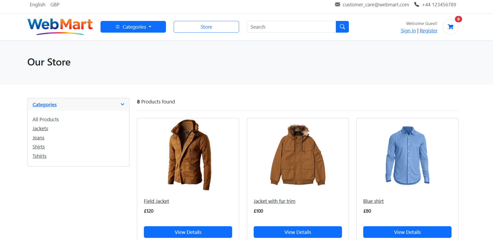
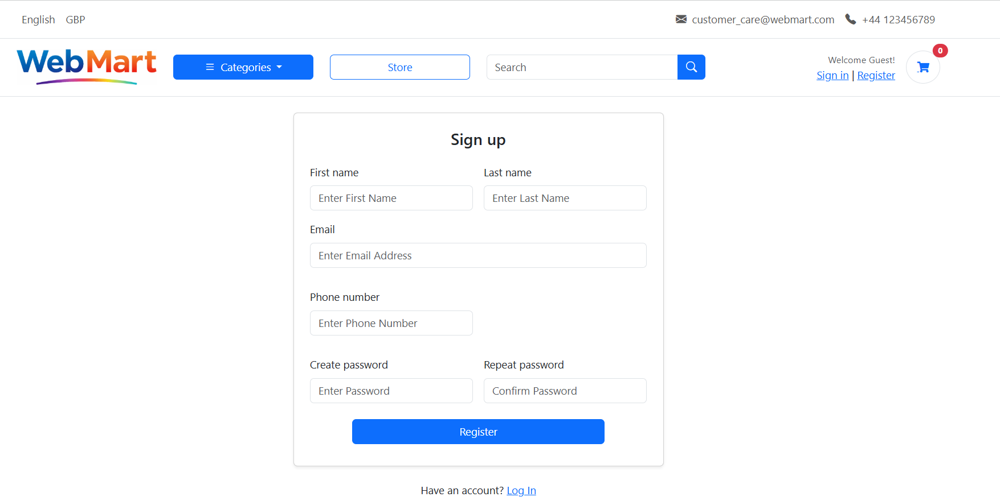
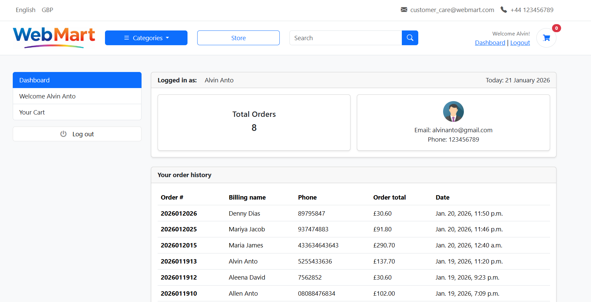
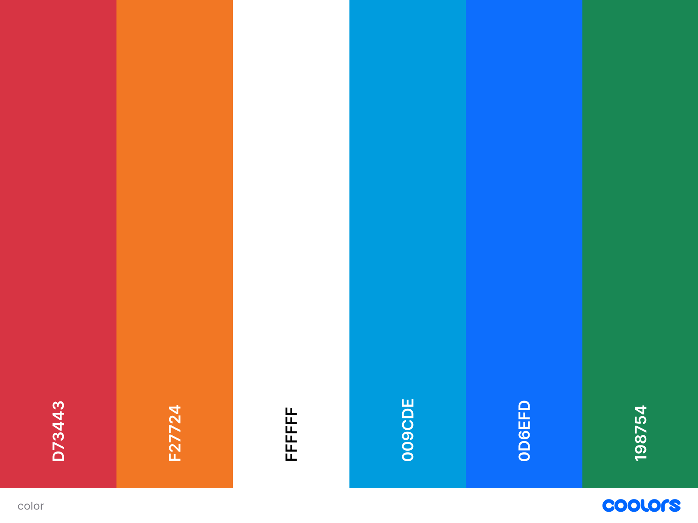

# WebMart - E-Commerce Store Application

WebMart is a full-featured e-commerce web application built with Django and PostgreSQL which allows users to browse products,login, manage shopping carts, place orders, and manage their user accounts.

Source code can be found [here](https://github.com/sheenaanto/WebMart)

The live project can be viewed [here](https://webmart-df0a62d3a5c7.herokuapp.com/)

Table of Contents

## Purpose of the project

This project was developed as a learning exercise to demonstrate full-stack web development skills using Python with Django and PostgreSQL. It showcases practical implementation of e-commerce functionality including user authentication, product management, shopping cart operations, and order processing with a modern, responsive user interface.

## Features

- **User Authentication**: User registration, login, and dashboard
- **Product Catalog**: Browse products by categories with detailed product information
- **Shopping Cart**: Add/remove items from cart with persistent storage
- **Order Management**: Place orders and track order history
- **Responsive Design**: Mobile-friendly interface using Bootstrap 5
- **Admin Panel**: Django admin interface for managing products, categories, and orders
- **Toast Notifications**: User feedback with success, error, warning, and info messages

### All Users

The following pages are visible to all users, logged in or not.

Homepage (landing page)

#### Key Features

The landing page offers users different options:

- Navigate through categories
- Navigate through products
- View cart items
- Store
- Search for products
- Sign in
- Register

Store page

#### Key Features

Different options available are :

- Product details view option
- View cart
- Search for products
- Sign in
- Register

Products details page

#### Key Features

Different options available are :

- Navigate through categories
- Product details view option
- View cart
- Search for products
- Sign in
- Register

Carts page

#### Key Features

Different options available are :

- +/- for increase/decrease options
- Remove cart item
- checkout (Login/Register page)
- Continue shopping

login page

#### Key Features

Different options available are :

- Login button
- Sign up

Register page

#### Key Features

Different options available are :

- Enter details
- Register
- Login

### Authenticated (Logged in) Users

The following pages are only available to logged in users.

Dashboard

#### Key Features

This page shows details on:

- Total no.of orders placed
- Order history
- User details
- Logout

Checkout

#### Key Features

This page offers users different options:

- Enter billing address
- Place order
- Continue shopping
- Logout

## User Experience

This section details the key elements of the user experience (UX) design for the project, including visual design choices, color schemes, typography, and wireframes. It provides insight into the aesthetic and functional decisions made to enhance usability across different devices, ensuring a seamless and accessible experience for users.

### Design

#### Fonts/Icons

- Inter font
  This font was used throughout the project for headings and prominent text.This is a great choice for an e-commerce platform as it balances professionalism with modern aesthetics.It is a modern, clean sans-serif font that provides excellent readability for web interfaces.

- Font Awesome - Icon library
  The navbar heavily uses Bootstrap Icons for the header elements.

- Bootstrap Icons - Icon library
  Throughout the product pages and cart functionality for action-related icons.

#### Colour

The following colour palette was used in the project:

**Primary Colors**

| Color  | Hex Code  | RGB               | Usage                                      |
| ------ | --------- | ----------------- | ------------------------------------------ |
| Blue   | `#3167eb` | rgb(49, 103, 235) | Primary brand color, buttons, hover states |
| Orange | `#ff9017` | rgb(255, 144, 23) | Accent color, alerts, warnings             |
| Green  | `#00b517` | rgb(0, 181, 23)   | Success states, confirmations              |
| Red    | `#fa3434` | rgb(250, 52, 52)  | Error states, alerts                       |

**Neutral Colors**

| Color      | Hex Code  | RGB                | Usage                        |
| ---------- | --------- | ------------------ | ---------------------------- |
| White      | `#ffffff` | rgb(255, 255, 255) | Background, cards            |
| Light Gray | `#f8f9fa` | rgb(248, 249, 250) | Secondary background         |
| Dark Gray  | `#212529` | rgb(33, 37, 41)    | Text, overlays (40% opacity) |

**Gradient Variations**

- **Blue Gradient**: `rgba(49, 103, 235, 0.9)` to `rgba(33, 37, 41, 0.4)` - Used for hover effects and interactive elements
- **Green Gradient**: `rgba(0, 181, 23, 0.9)` to `rgba(33, 37, 41, 0.4)` - Success state gradients
- **Orange Gradient**: `rgba(255, 144, 23, 0.9)` to `rgba(33, 37, 41, 0.4)` - Warning state gradients
- **Red Gradient**: Similar pattern with red tones - Error state gradients

**Design Approach**

The color scheme follows a clean, modern e-commerce design with:

- **Blue** as the dominant brand color (professional, trustworthy)
- **Bright accent colors** for clear visual hierarchy and status indicators
- **Neutral backgrounds** for readability and content focus
- **Gradients** for hover effects and interactive elements

## Wireframes

These wireframes illustrate how each page is designed to adapt across various screen sizes, including Mobile, Tablet, Desktop, and Larger Screens. While the overall layout remains consistent, adjustments have been made to optimize the user experience for each viewport. Key differences include variations in button placement, layout, and card arrangements to ensure usability and visual clarity across devices.

Desktop

Tablet

Mobile

## Development Process

The development process for this project was carefully planned and documented to ensure efficient progress and transparency. This section outlines how the project was broken down into manageable tasks, tracked, and prioritized using GitHub Issues and Projects. Each sub-section provides a detailed look at the tools and methods used to guide development from initial planning to implementation.

### Project Planning and Documentation Using GitHub

Userstories All user stories can be found here.Issues were posted to the board and moved from "Todo" to "In Progress" to "Done" as they were completed. MoSCoW prioritisation was applied using the labels must-have, should-have, and could-have.

  

Must have

Should have

Could have

Won't have

Full [Project Board](https://github.com/users/sheenaanto/projects/17)

## Data Model

This section provides an overview of the data models used in the project, represented through Entity-Relationship Diagrams (ERDs) for each application.

## Data Validation

Django Widget attributes have been used to provide min and max markers for form fields ensuring only values in a certain range can be submitted.

## Testing

The Testing section covers various strategies used to ensure the application's functionality and quality

### Manual Testing

Feature Testing

### Responsiveness

All pages on the live site were tested with the default list of devices in Chrome Devtools.

### Lighthouse

The Lighthouse testing was carried out using a chrome extension .The results are displayed by page below:

Lighthouse results

## Validation Testing

### Python Validation

All python code is validated by the Flake8 linter (installed in VSCode) and CI Python Linter. The exceptions to this were django migration files, urls and similar files. However, any custom models, views and forms were validated. I have separated this by app:

webmart

views.py

store

views.py

accounts

views.py

carts

views.py

orders

views.py

### JavaScript Validation

All JavaScript code is validated by the ESLint (installed in VSCode) and JS Hinterface.

Main templete - base.html

Contains global JavaScript that runs on all pages - Bootstrap functionality and toast notifications

Checkout page - checkout.html

Contains page-specific JavaScript for order success modal display

HTML Validation
All HTML was validating using the page source of the deployed project using W3C Markup Validation Service. All pages were clear of all errors/warnings. There was only one page where an additonal factor was noted. This was on the menu page which had an 'info' warning. This was related to the way the Cloudinary image is used in the menu item modal.

Menu Page
All Other Pages
CSS Validation
The single CSS file was validated using the W3C Validation Service

Results

## Libraries and Programs Used

This section highlights the key libraries, tools, and platforms utilised throughout the development of the project. These technologies played an essential role in various aspects of the project, from wireframing and version control to deployment and testing.

Balsamiq
Balsamiq was used to wireframe all the pages in the project.
Git
Version control was implemented using Git through the GitHub terminal.
Github
GitHub was used to store the project after being pushed from Git. The cloud service GitHub Pages was used to deploy the project on the web, while GitHub Projects tracked User Stories, Epics, bugs, and other issues throughout the development.
Gitpod
Gitpod was used as the primary IDE for development, with ESLint and Flake8 linters configured for JavaScript and Python code validation, respectively.
Heroku
Heroku was used for deploying the project.
pytest
Pytest was used for automated testing of the project.
Canva
Canva was used to generate the logo for this project
Photoroom
Photoroom was used to transfomr images to have a transparent background
ChatGPT
ChatGPT was the primary AI tool used to aid development through a variety of areas such as bug-fixing, tests devlopment, introduction to form and model methods, improving accessibility and code maintainability as well as initial planning such as outlining scope and developing Epics and Stories.
Pexels
Pexels was used as the primary source of background images used in the project.

## Credits
